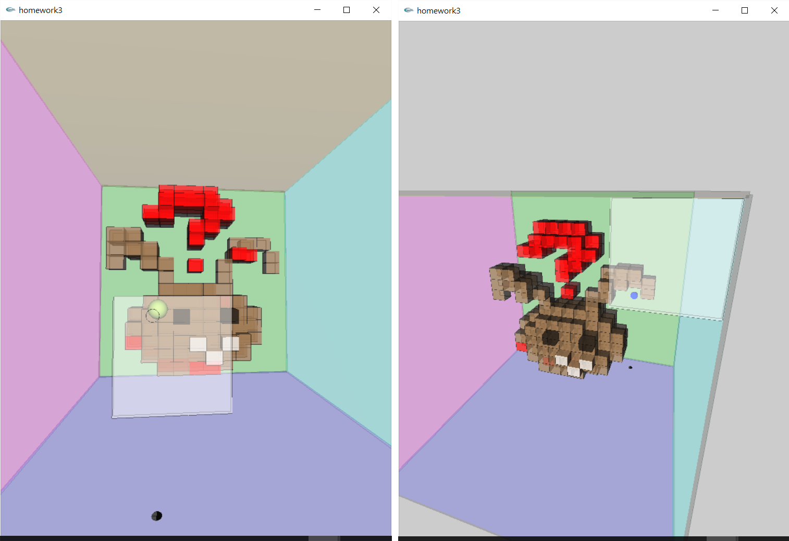

## Computer Graphics Assignments
This repository contains the assignments of Computer Graphics implemented using C with OpenGL library when I was pursing Bachelor degree at NTUST, Taipei, Taiwan in 2010 Spring.

You can see my C code and download the execution files in each subfolder.  Enjoy it!

